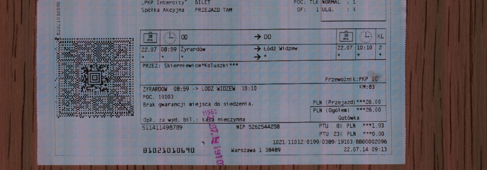
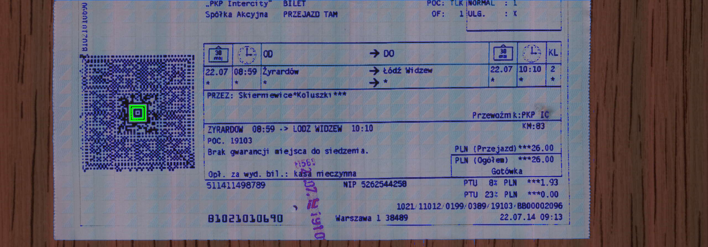
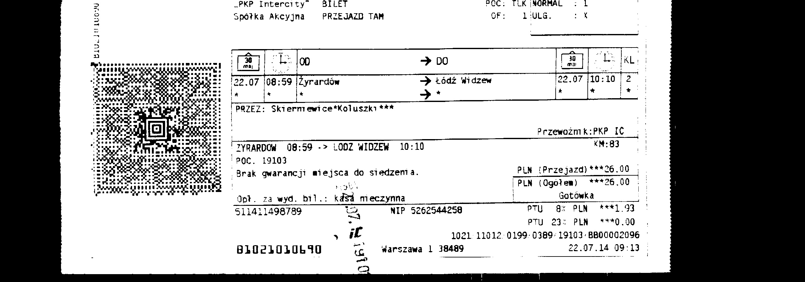
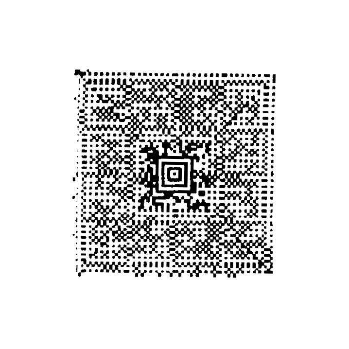

# python-cv2-aztec-extraction
A helper script to find and extract Aztec code from image. Used alongside Zxing to improves "detectability" of large(r) codes based on [AnonimowiAnalitycy/Z3SBarcodeScanner](https://github.com/AnonimowiAnalitycy/Z3SBarcodeScanner).

* Dirty implementation in 4 hours
* Tested 15 times on small sample of codes
* Silly, but works™

## Demo

| Image | 
|-|
||
||
||
||

